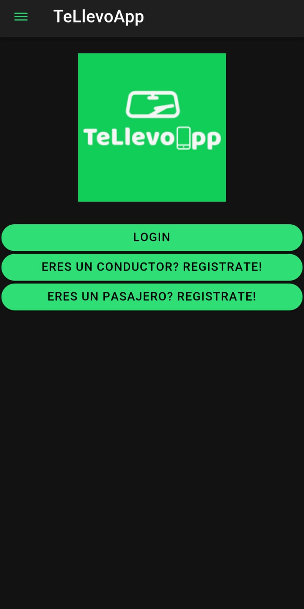
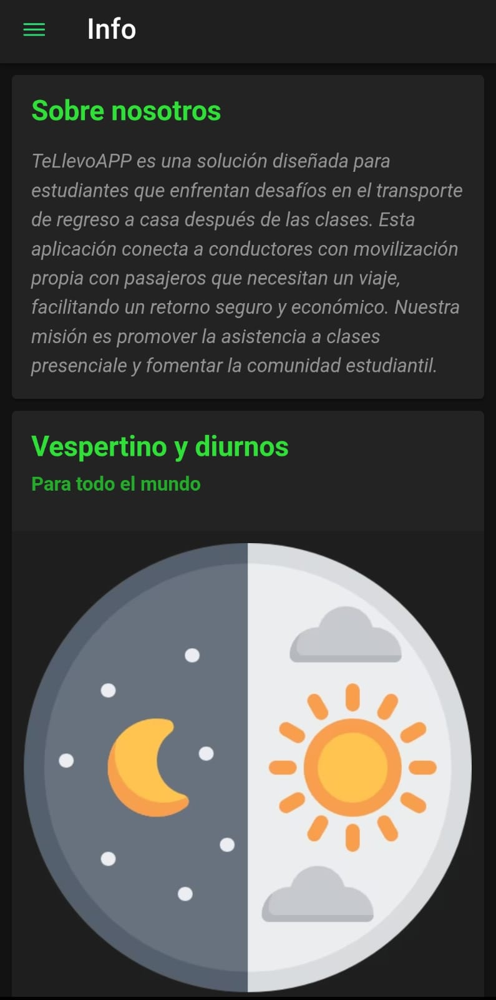

# TeLlevoApp

**TeLlevoApp** es un proyecto desarrollado para la asignatura de **Programación de Aplicaciones Móviles**. Se trata de una solución móvil construida con **Ionic y Angular** diseñada para apoyar a los estudiantes que enfrentan dificultades de transporte al finalizar sus jornadas académicas.

La aplicación conecta a conductores que cuentan con vehículo propio con pasajeros que necesitan un trayecto, promoviendo un retorno seguro, económico y fortaleciendo la comunidad estudiantil.

## Vista Previa de la Aplicación

A continuación se muestran ejemplos de la interfaz de usuario en las pantallas principales:

| Pantalla de Inicio | Pantalla de Información |
| :---: | :---: |
|  |  |

## Características Principales

* **Registro de Usuarios Diferenciado**: Permite el registro tanto de pasajeros como de conductores, solicitando a estos últimos datos específicos como matrícula y modelo del vehículo.
* **Gestión de Autenticación**: Sistema de inicio de sesión que valida credenciales y utiliza `sessionStorage` para mantener la persistencia de la sesión.
* **Protección de Rutas (Guards)**: Implementación de un `AutorizadoGuard` para asegurar que secciones como noticias o el panel principal solo sean accesibles para usuarios autenticados.
* **Perfil de Usuario**: Funcionalidad para que los usuarios visualicen y actualicen su información personal, incluyendo nombre, email y edad.
* **Consumo de API Externa**: Integración con una API de noticias (NewsAPI) para mostrar información relevante del sector en tiempo real.
* **Interfaz de Usuario Intuitiva**: Uso de componentes de Ionic como Menús laterales, Cards, Toasts y alertas para una experiencia fluida.

## Tecnologías Utilizadas

* **Framework**: Ionic Framework con Angular.
* **Lenguaje**: TypeScript para la lógica de negocio.
* **Estilos**: SCSS para un diseño visual personalizado y consistente.
* **Servicios REST**: Uso de `HttpClient` para la comunicación con el backend y APIs externas.
* **Validaciones**: Uso de `ReactiveFormsModule` para la gestión robusta de formularios y validaciones de datos.

## Estructura del Proyecto

* `app/pages/`: Contiene los módulos, componentes y lógica de cada pantalla (inicio, login, registros, principal, perfil, noticias).
* `app/servicios/`: Incluye `AuthService` para la gestión de identidad y `ApiService` para el consumo de datos externos.
* `app/guards/`: Contiene el `AutorizadoGuard` para la seguridad de la navegación.
* `app/interfaces/`: Definición de modelos de datos para usuarios, conductores y artículos de noticias.
* `assets/`: Recursos gráficos y multimedia de la aplicación.
---
**Desarrollado por**: Cristian Silva e Ignacio Hernández.
**Asignatura**: Programación de Aplicaciones Móviles.
